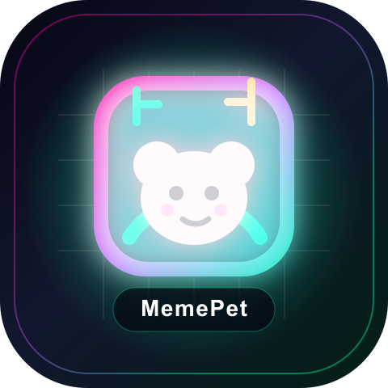

# MemePet



**Your wallet hatches a living meme-trading pet.**

MemePet is an AI-powered on-chain companion for meme coin traders. Instead of giving users another cold trading dashboard or a giant chat box, MemePet turns wallet behavior into a living pet with personality, mood, energy, hunger, goals, and trade reactions.

It is built for the emotional reality of meme trading: green candles deserve celebration, red candles need comfort, and every wallet has a story.

## Submission Pack

- Project name: **MemePet**
- Logo: [`public/memepet-logo-480.png`](public/memepet-logo-480.png) and [`public/memepet-logo-480.svg`](public/memepet-logo-480.svg)
- Submission brief: [`docs/SUBMISSION.md`](docs/SUBMISSION.md)
- Demo video script: [`docs/DEMO_VIDEO_SCRIPT.md`](docs/DEMO_VIDEO_SCRIPT.md)
- Pitch deck: [`docs/memepet-pitch-deck.pptx`](docs/memepet-pitch-deck.pptx)

## Vision

Meme trading is not just financial behavior. It is social, emotional, chaotic, and deeply on-chain. MemePet imagines a new interface for crypto: not a bot that tells you what to do, but a companion that grows from your behavior and stays with you through every trade.

Our vision is to make wallets feel alive. A user's wallet should not only store assets; it should express their trading rhythm, habits, risk appetite, and emotional journey. MemePet is the first step toward a living, playful, AI-native wallet companion for BSC and meme coin culture.

## Why It Matters

Most trading tools optimize for execution, charts, or alerts. They rarely address the human loop: excitement, regret, conviction, boredom, FOMO, and community identity.

MemePet turns this into a product loop:

- Wallet behavior becomes pet DNA.
- Market events become food.
- Trade pulses change pet mood and vitals.
- Wins trigger celebration.
- Losses trigger emotional support.
- Goals become lightweight rituals.
- On-chain identity lets the pet become part of the user's crypto journey.

## Core Demo Flow

1. **Wallet Hatch**
   - Enter a BSC wallet.
   - MemePet analyzes wallet behavior and creates Trading DNA.
   - The pet hatches with a matching personality and initial vitals.

2. **Post-Hatch Cockpit**
   - The user lands in a unified meme trader cockpit.
   - Pet status keeps XP, Energy, Satiety, and Meme score in one place.
   - Wallet DNA, goals, on-chain status, and actions are visible without feeling like a cluttered dashboard.

3. **Live Trade Pulse**
   - Trigger trade events: Ape In, Green, Red, Exit.
   - The pet reacts instantly with mood, XP, vitals, and dialogue.
   - This demonstrates the production interaction model for future live wallet event streams.

4. **Feed Market**
   - Market hotlists and news become pet food.
   - The pet gains energy and comments on market context.

5. **Small Companion Chat**
   - Chat appears as a compact desk-side bubble, not a full-screen chatbot.
   - The pet remains a companion window beside the trading experience.

6. **Mint / Share**
   - The pet can be shared.
   - On-chain identity minting is available as a bonus path.

## Is This BUIDL an AI Agent?

**Yes. MemePet is an AI agent.**

MemePet is not just a static character skin. It observes user context, maintains persistent state, interprets wallet and market signals, and acts through a personality-driven companion loop.

Agentic properties:

- **Perception:** reads wallet summaries, goals, conversation history, market/news context, and trade pulse events.
- **Memory:** stores pet state, XP, level, vitals, goals, wallet DNA, and conversation history.
- **Reasoning:** uses AI prompts to generate pet personality, interpret market context, and respond in-character.
- **Action:** updates mood, XP, vitals, messages, goals, and optional on-chain identity state.
- **Autonomy:** wakeup logic can proactively generate messages after inactivity.
- **Goal alignment:** reacts according to user-defined goals and wallet-derived Trading DNA.

In the current MVP, live trade pulses are demo-triggered to make judging stable. The intended production step is BSC wallet event polling or webhook-based event ingestion.

## Key Features

- Wallet-as-DNA pet hatch
- Trading style inference
- AI-generated pet personality
- Meme trader cockpit UI
- Pet vitals: XP, Energy, Satiety, Meme score
- Live Trade Pulse event reactions
- Feed Market mechanic
- Small companion chat
- Goal tracking with Done / Missed rituals
- Optional EIP-8004-style agent identity mint
- EN / ZH product copy support

## Tech Stack

- Next.js 16 App Router
- React 19
- TypeScript
- Tailwind CSS 4
- AI SDK / Groq
- Moralis-style BSC wallet analysis
- four.meme market ranking context
- BSC / viem / wagmi integration
- Local pet state persistence

## Environment Variables

Create `.env.local` with the relevant keys for full functionality:

```bash
GROQ_API_KEY=
MORALIS_API_KEY=
PET_WALLET_PRIVATE_KEY=
OPENNEWS_TOKEN=
```

The core demo remains usable with fallback paths when some external services are unavailable.

## Run Locally

```bash
npm install
npm run build
npm start
```

Open:

```bash
http://localhost:3000
```

## Hackathon Notes

MemePet is designed as a hackathon-ready MVP:

- Wallet DNA analysis is real behavior inference, not precise PnL accounting.
- Live Trade Pulse currently uses deterministic demo events to make the judging flow stable.
- Production readiness would require real-time wallet event ingestion, database-backed user state, rate limiting, wallet signature auth, and stronger mint security.

## Roadmap

- Real BSC wallet event polling / webhook ingestion
- Accurate PnL and position lifecycle analysis
- Wallet signature login and cloud pet sync
- Pet evolution trees based on trading archetypes
- Shareable pet cards and social referral loops
- four.meme-native launch / token discovery integrations
- Agent identity registry and portable on-chain companion profile
